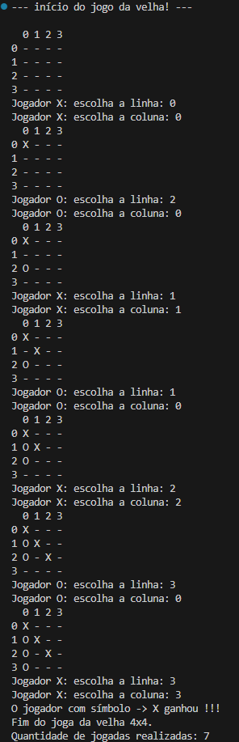
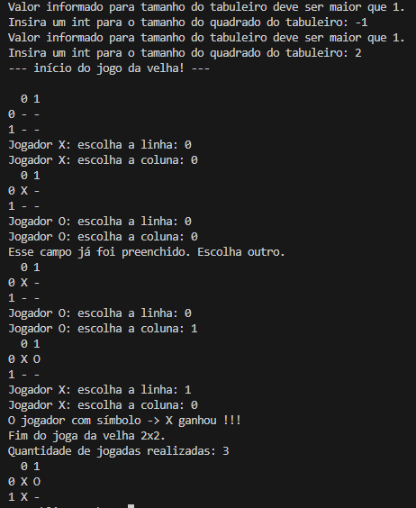

# Exercícios avaliativos realizados na disicplina de tópicos especiais de software.

Foi adotado desenvolvimento orientado a objetos para resolução dos exercícios (minha preferência). Alguns dos requisitos foram levemente adaptados mas todos coportamentos esperados estão presentes nos programas.

Estratégia para resolução dos exercícios foram descritas nas classes, comentários com Docstrings feitos para classes e métodos.

* Foram atentdidos todos requisitos da lista.
* Para gerar os comentários, foi utilizado um plugin auxiliar no vsc chamado autoDocstring - Python Docstring Generator.
* Imagens de exemplo dos programas sendo executados abaixo.
* libs utilizadas:
    random - para adquirir um arquivo randômico no ex3.
    sys - para finalizar o programa no ex4.

# Programas em execução:

## ex1 - jogo da velha 4x4

## ex2 - jogo da velha NxN

## ex3 - Termo

[print do jogo Termo](./images/ex3_termo.png)

## ex4 - simulador de banco de dados em memória

* Cadastro de usuários
[print do simulador de banco de dados em memória (cadastro)](./images/ex4_cadastro.png)

* Exibição de usuários
[print do simulador de banco de dados em memória (exibição)](./images/ex4_pesquisas.png)